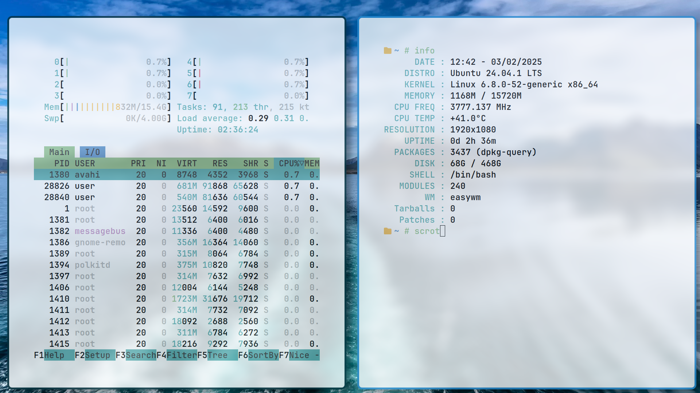

# easywm
0.1 Prototype! Building a Linux Window Manager from scratch | In the picture below you can see the current status of the development. There are still many problems but there is already a significant improvement than version 0.1

<h1>
      

 
