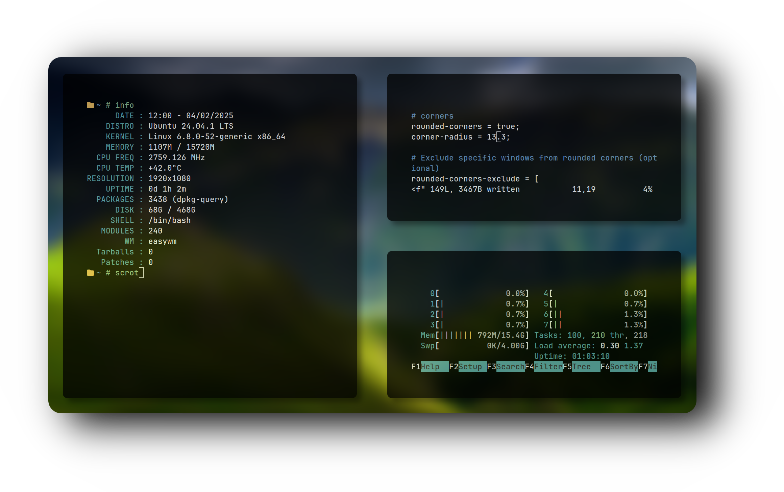
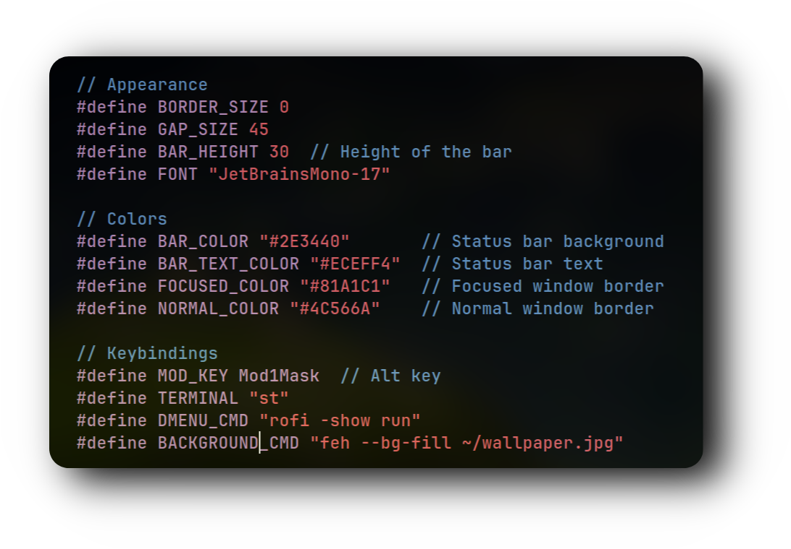

<div align="center">


<h1>
      
</div>
</div> 


<div align="center">
  <h2 style="font-size: 74px;">
    <strong> 
      <a href="https://user7210unix.github.io/easywm-website/" style="text-decoration: none; color: inherit;">
        𝗘𝗔𝗦𝗬𝗪𝗠 - 𝗪𝗘𝗕𝗦𝗜𝗧𝗘
      </a> 
    </strong>
  </h2>
</div>
      
<div align="center">

<div style="display: flex; align-items: center; margin-bottom: 40px;">
  <div style="flex: 1; padding-right: 20px;">
    <p><strong>🖇️ Simple Stacking WM I made from ground up, using C, mostly for educational purposes. I was unhappy with other existing stacking WM so I'm now using my own. </strong></p>
    <p>Since it's still very early in development, some bugs may appear, but I'm doing my best to ship the most polished version of this project. 🫡</p>
<h1>


<div align="center">

𝙄𝙣𝙨𝙩𝙖𝙡𝙡𝙖𝙩𝙞𝙤𝙣 🧘 

```
curl -fsSL https://raw.githubusercontent.com/user7210unix/easywm/main/install.sh | bash
```

<h1>
      
</div>
</div> 


<div align="left">

  
 ⚙️ 𝗙𝗲𝗮𝘁𝘂𝗿𝗲𝘀
- **Developed from Scratch** ⚙️
- **Written in C Lang** 🇨 
- **Uses ST-Terminal as Default** 🖥️ 
- **Uses less resources then dwm** 📊 
- **Compositor Support** 👨‍🔬 
- **Support for Menu** 📋 


<h1>
      
</div>
</div> 


<div align="right">


## 🔑 Key Bindings

#### 📱 **Applications**

 **ALT+Q** – KILL WINDOW 
 **ALT+RETURN** – ST 
 **ALT+P** – DMENU
 **ALT+SHIFT+P** – KILL SESSION
